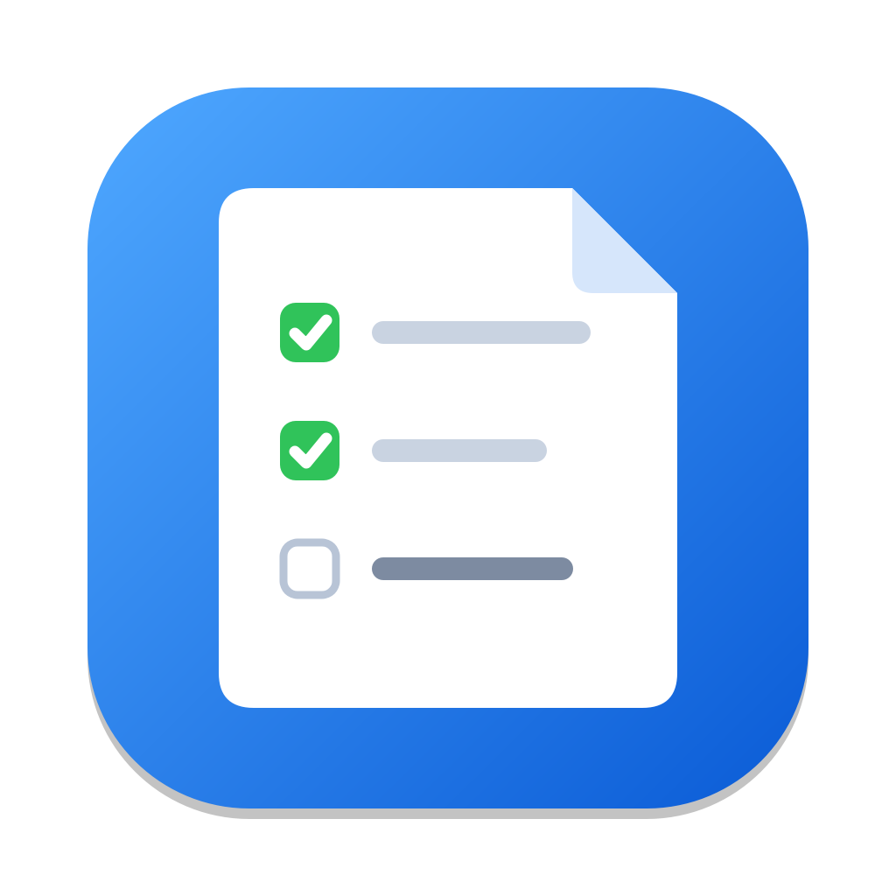
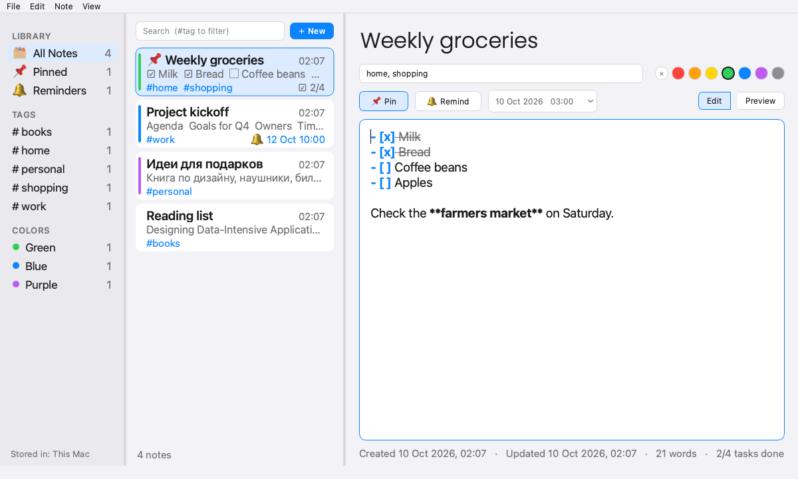
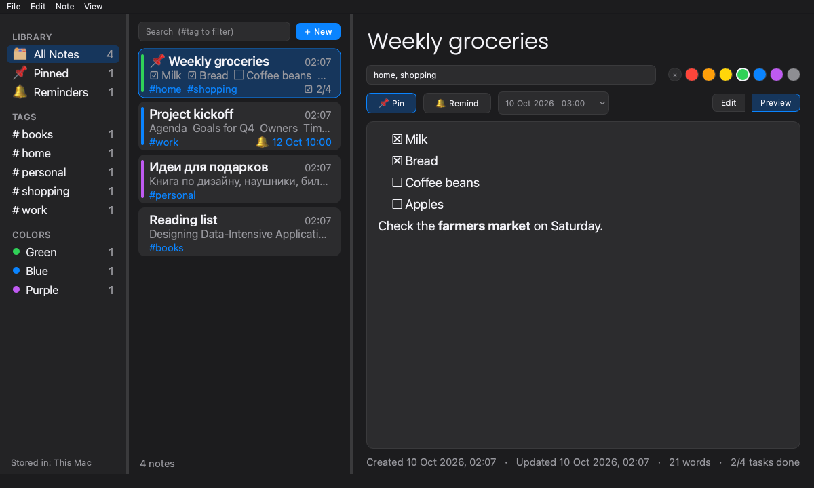

<p align="center"></p>

<h1 align="center">Micronotes</h1>

<p align="center">A fast, offline Markdown notes app for macOS: tags, colours, checklists, reminders and iCloud sync.</p>



## Features

- **Markdown notes** with live syntax highlighting and a rendered preview (`⌘E`). Checkboxes are clickable in the preview.
- **Checklists**: `- [ ] task` items. The list shows progress (`☑ 2/4`).
- **Tags**: a comma-separated tag field with autocomplete. Every tag appears in the sidebar as a filter.
- **Colour labels**: seven colours. Each colour in use appears in the sidebar as a filter.
- **Pinned notes** stay at the top of every list.
- **Reminders**: macOS notifications at a date and time you choose.
- **Search** across titles, text and tags. Use `#tag` in the query to filter by tag.
- **Autosave**: there is no Save button and no lost edits.
- **Undo delete**: up to 20 steps.
- **Import**: `.json`, `.csv`, `.md`, `.txt` and other text files. UTF-8 and Windows-1251 files are both supported.
- **Export** all or selected notes to Markdown, plain text, CSV (opens in Excel), JSON or HTML.
- **Storage location**: this Mac, **iCloud Drive** or any folder (Dropbox, a network drive and so on). Changes made on another Mac are picked up live.
- **Themes**: System, Light or Dark. The System theme follows macOS automatically.
- **Safe storage**: atomic writes and a backup copy every session. A damaged file is never overwritten.



## Installation

### Option A: build the app (recommended)

Requirements: macOS 13 (Ventura) or later and Python 3.10 or later ([python.org](https://www.python.org/downloads/) or Homebrew).

```bash
git clone <repository-url> Micronotes
cd Micronotes
python3 -m venv .venv
.venv/bin/pip install -r requirements-dev.txt
.venv/bin/pyinstaller --noconfirm micronotes.spec
```

The app is created at `dist/micronotes.app`. Drag it into **Applications**. You can also keep it where it is and put an alias on the Desktop: right-click → *Make Alias*.

> **First launch:** the app is not signed with an Apple Developer ID, so macOS may say it "cannot be opened". Right-click the app → **Open** → **Open**. You only need to do this once.

### Option B: run from source

```bash
python3 -m venv .venv
.venv/bin/pip install -r requirements.txt
.venv/bin/python micronotes.py
```

### Updating

```bash
git pull
.venv/bin/pip install -r requirements-dev.txt
.venv/bin/pyinstaller --noconfirm micronotes.spec
```

Your notes are stored outside the project folder (see [Your data](#your-data)), so rebuilding never touches them.

## User guide

### The window

| Area | What it does |
|---|---|
| **Sidebar** (left) | Filters: *All Notes*, *Pinned*, *Reminders*, each tag and each colour in use. The bottom line shows where the notes are stored. Hide it with `⌥⌘S`. |
| **Notes list** (middle) | Note cards with title, preview, tags, task progress and reminder. Search sits at the top. |
| **Editor** (right) | Title, tags, colour, pin, reminder and the note text. *Edit* / *Preview* switch between Markdown source and the rendered note. |

### Writing notes

1. Press `⌘N` or click **＋ New**. If a tag, colour or *Pinned* filter is active, the new note gets that tag, colour or pin.
2. Type a title and press `Return` to move into the text.
3. Write in Markdown. Changes are saved automatically about half a second after you stop typing.

Markdown that the editor highlights and the preview renders:

```markdown
# Heading            ## Smaller heading
**bold**  *italic*  ~~strikethrough~~  `code`
- bullet             1. numbered item
- [ ] open task      - [x] done task
> quote              [link](https://example.com)
```

Editor helpers:

- **Return** at the end of a list item starts a new item (`- `, `2. `, `- [ ] `). Return on an empty item ends the list.
- **Tab** / **⇧Tab** on a list item indents or outdents it.
- `⌘B`, `⌘I` and `⇧⌘X` wrap the selection in bold, italic or strikethrough.
- `⇧⌘L` turns the current lines into a checklist, or back.
- `⇧⌘H` cycles the heading level.
- In **Preview** (`⌘E`), click a checkbox to tick it. The change is written back to the Markdown.

A new note that you leave without typing anything is discarded automatically.

### Tags and colours

- Type tags into the tag field, separated by commas: `work, project x`. Suggestions appear as you type. A leading `#` is optional.
- Click a colour dot to label the note. `✕` removes the label. You can also right-click notes in the list → **Color**.
- To filter, click a tag or colour in the sidebar, or type `#tag` into search. Search terms combine: `#work budget`.

### Pinning

Click **📌 Pin** in the editor or press `⇧⌘P` (this works on several selected notes too). Pinned notes always stay on top.

### Reminders

1. Click **🔔 Remind** (`⇧⌘R`). The time defaults to the next full hour.
2. Change the date and time in the field next to it. Click the arrow to pick from a calendar.
3. When the time comes, a macOS notification appears and the note is marked `✓ Reminded`.

Reminders are checked while Micronotes is running. A reminder that came due while the app was closed fires as soon as you open it. The **Reminders** filter in the sidebar lists upcoming reminders in date order.

> If no notifications appear, open **System Settings → Notifications** and allow notifications for **Script Editor**. Micronotes uses it to show notifications without a signed app.

### Selecting, deleting, copying

- `⌘`-click or `⇧`-click to select several notes.
- With the list focused: `⌫`/`Delete` deletes, `⌘Z` restores what was deleted, `⌘C` copies the notes as Markdown, and `Return` jumps to the editor.
- Right-click a note for Pin, Duplicate, Copy, Export, Color and Delete.

### Sorting

**View → Sort By**: *Date Updated* (default), *Date Created* or *Title*. Pinned notes always come first.

### Import and export

**File → Import…** (`⇧⌘I`) accepts several files at once:

| Format | How it is imported |
|---|---|
| `.json` | A Micronotes export or backup, including files from the old 1.x version. |
| `.csv` | First row is the header. Recognised columns: *Title/Subject*, *Text/Description/Body*, *Tags*, *Color*, *Created*, *Updated*, *Pinned*, *Remind*. Russian header names also work. The separator (`,` `;` or tab) is detected automatically. |
| `.md` | A Micronotes Markdown export is split back into notes. Any other Markdown file becomes one note, titled by its first `# heading`. |
| `.txt`, `.text`, `.log`, `.rst`, `.org` | One note per file, titled by the file name. |

**File → Export All…** (`⇧⌘E`) or **Export Selected…**. The file type you choose in the dialog sets the format:

| Format | Good for |
|---|---|
| Markdown `.md` | Obsidian, Bear, GitHub, any Markdown editor |
| Plain text `.txt` | Mail, messengers |
| CSV `.csv` | Excel and Numbers (UTF-8 with BOM, so non-Latin text displays correctly) |
| JSON `.json` | Full backup, which can be imported back |
| HTML `.html` | Sharing or printing. The page has light and dark themes. |

### Themes

**View → Theme**: *System* (follows macOS, including automatic switching), *Light* or *Dark*.

## Your data

| What | Where |
|---|---|
| Notes (default) | `~/Library/Application Support/micronotes/notes.json` |
| Backup of the previous state | `notes.backup.json`, in the same folder, refreshed once per session |
| Settings (theme, window size, location) | `~/Library/Application Support/micronotes/settings.json` (always local) |

**File → Data Location → Show in Finder** opens the current folder.

### Sync with iCloud Drive

**File → Data Location → iCloud Drive** moves storage to `iCloud Drive/Micronotes/notes.json`.

- If that folder already contains notes from another Mac, the two sets are **merged**. For each note, the most recently edited version wins.
- The old file stays where it was, so nothing is deleted.
- Do the same on your other Macs. Changes made on one Mac appear on the others while Micronotes is open.
- To use Dropbox, Google Drive, a NAS or any other folder, choose **Custom Folder…**.

> Avoid editing the same note on two Macs at the same moment. iCloud may then keep one version and save the other as `notes 2.json` in the same folder.

### If something goes wrong

- **"Could not read notes" at start-up**: the file was damaged. It is copied to `notes.broken-<date>.json` and left untouched, and the app starts empty. Restore it with **Import…** using `notes.backup.json`, or fix the broken copy.
- **Upgrading from version 1.x**: the old *Additional info* field becomes the note's tags automatically. Nothing else is needed.

## Keyboard shortcuts

| Shortcut | Action |
|---|---|
| `⌘N` | New note |
| `⌘D` | Duplicate note |
| `⌘F` | Search (`Esc` clears it, `↓` / `Return` moves into the list) |
| `⌘E` | Toggle Edit / Preview |
| `⇧⌘P` | Pin / unpin |
| `⇧⌘R` | Set or clear the reminder |
| `⌘B` / `⌘I` / `⇧⌘X` | Bold / italic / strikethrough |
| `⇧⌘L` | Checklist |
| `⇧⌘H` | Heading |
| `⇧⌘I` / `⇧⌘E` | Import / Export all |
| `⌥⌘S` | Show / hide sidebar |
| `⌫`, `Delete` *(in the list)* | Delete selected notes |
| `⌘Z` *(in the list)* | Undo delete |
| `⌘C` *(in the list)* | Copy selected notes as Markdown |

## Development

```text
micronotes.py        entry point
app/storage.py       note schema, migration, atomic JSON store, settings, merge
app/formats.py       import / export (md, txt, csv, json, html)
app/mdtools.py       Markdown helpers (tasks, list continuation, previews)
app/editor.py        Markdown editor + highlighter, clickable preview
app/widgets.py       painted note cards, sidebar rows, colour picker
app/window.py        main window and all user actions
app/theme.py         palettes, fonts (Poppins from ./font), stylesheet
app/notify.py        macOS notifications
tools/make_icon.py   regenerates assets/icon.png and assets/micronotes.icns
tests/               pytest suite (logic + offscreen GUI tests)
```

```bash
.venv/bin/pip install -r requirements-dev.txt
.venv/bin/python -m pytest -q                        # run the tests
.venv/bin/python tools/make_icon.py                  # rebuild the icon
.venv/bin/pyinstaller --noconfirm micronotes.spec    # build dist/micronotes.app
```

Fonts: any `.ttf` files placed in `font/` are bundled. The first family found (Poppins) is used for note titles. Add `Poppins-Regular.ttf` or `Poppins-Medium.ttf` there for heavier title weights.

`build/` and `dist/` are generated by PyInstaller and are not tracked in git.
